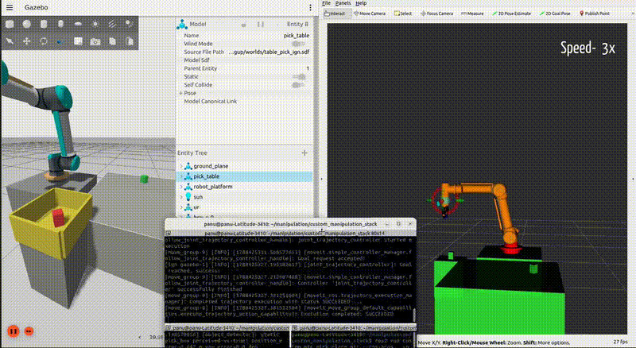

# custom-manipulation-stack

> **A ROS 2 Humble Manipulation Stack for UR5e + Robotiq 2F-85 in Gazebo Fortress & MoveIt 2**

## 🎥 Pick and Place Demo




## 📋 Table of Contents

- [Overview](#overview)
- [System Architecture](#system-architecture)
- [Detailed Folder & Package Guide](#detailed-folder--package-guide)
  - [`src/custom_robot_description`](#1-srccustom_robot_description)
  - [`src/custom_gripper_description`](#2-srccustom_gripper_description)
  - [`src/custom_moveit_config`](#3-srccustom_moveit_config)
  - [`src/custom_robot_bringup`](#4-srccustom_robot_bringup)
  - [`src/custom_robot_manipulation`](#5-srccustom_robot_manipulation)
  - [`src/custom_perception`](#6-srccustom_perception)
  - [`src/custom_robot_interfaces`](#7-srccustom_robot_interfaces)
  - [`src/custom_mtc`](#8-srccustom_mtc)
  - [`docs`](#9-docs)
- [Gripper & End-Effector Setup](#gripper--end-effector-setup)
- [Quick Start & Setup](#quick-start--setup)
- [Launch & Workflow Modes](#launch--workflow-modes)
  - [Mode 1: Basic Robot Simulation & Control](#mode-1-basic-robot-simulation--control)
  - [Mode 2: Dynamic Perception-Driven Pick & Place (MTC)](#mode-2-dynamic-perception-driven-pick--place-mtc)
  - [Mode 3: Static Pick & Place Debugging Flow](#mode-3-static-pick--place-debugging-flow)
- [Parameter & Command Reference](#parameter--command-reference)
- [Diagnostics & Inspection](#diagnostics--inspection)
- [Credits & Licensing](#credits--licensing)

---

## Overview

`custom_manipulation_stack` is a clean, modular ROS 2 Humble workspace for autonomous arm manipulation using the **Universal Robots UR5e** 6-DOF arm and **Robotiq 2F-85 parallel gripper**.

The repository brings together **Gazebo Fortress** (`ros_gz`) physics simulation, **MoveIt 2** motion planning, **wrist-camera RGB-D object detection**, and **MoveIt Task Constructor (MTC)** for dynamic pick, transport, and drop-to-bin workflows.

All packages are organized cleanly in `src/` as standalone ROS 2 packages without vendor repository bloat.

---

## System Architecture

```mermaid
graph TD
    subgraph Simulation ["Gazebo Fortress Simulation"]
        GZ[Gazebo Fortress Engine]
        CAM[Wrist RGB-D Camera]
    end

    subgraph Controllers ["ROS 2 Control Layer"]
        GZ_CTRL[gz_ros2_control / controller_manager]
        JT_CTRL[joint_trajectory_controller]
        GRP_CTRL[gripper_controller]
    end

    subgraph Perception ["Perception System"]
        PERC[custom_perception Node]
        SRV[/detect_objects Service]
    end

    subgraph Planning ["MoveIt 2 & Task Planning"]
        MOVEIT[move_group / MoveIt 2]
        MTC[custom_mtc: pick_place_mtc]
        CLIENTS[custom_robot_manipulation Nodes]
    end

    GZ -->|Color & Depth Data| CAM
    CAM -->|RGB-D Streams| PERC
    PERC -->|Populate Detections| SRV
    
    MTC -->|Request Object Poses| SRV
    MTC -->|Task Planning Steps| MOVEIT
    CLIENTS -->|Plan & Execute Motion| MOVEIT
    
    MOVEIT -->|Trajectory Goals| JT_CTRL
    MOVEIT -->|Gripper Action Goals| GRP_CTRL
    
    JT_CTRL -->|Joint Commands| GZ_CTRL
    GRP_CTRL -->|Gripper Commands| GZ_CTRL
    GZ_CTRL -->|Simulate Actuation| GZ
```

---

## Detailed Folder & Package Guide

The workspace is structured into 8 modular ROS 2 packages in `src/` plus project documentation in `docs/`:

```text
custom_manipulation_stack/
├── docs/                        # Project media, GIFs, and Root Cause Analysis (RCA) docs
├── setup.sh                     # Automatic setup script for dependencies and building
└── src/
    ├── custom_robot_description/ # UR5e URDF/Xacro models, mesh assets, joint limits
    ├── custom_gripper_description/# Robotiq 2F-85 description package and meshes
    ├── custom_moveit_config/    # SRDF, MoveIt 2 planning pipelines, kinematics, controllers
    ├── custom_robot_bringup/    # Launch files, Gazebo worlds, controller configs, object spawner
    ├── custom_robot_manipulation/# C++ MoveIt 2 client nodes (goto_pose, scene_demo, etc.)
    ├── custom_perception/       # Wrist RGB-D camera detector + /detect_objects service
    ├── custom_robot_interfaces/ # ROS 2 interface package (DetectObjects.srv)
    └── custom_mtc/              # MoveIt Task Constructor dynamic pick-and-place pipeline
```

---

### 1. `src/custom_robot_description`
**Role**: Pure data package defining the UR5e robot physical and visual model.

- **`urdf/`**:
  - `custom_robot.urdf.xacro`: Main URDF combining UR5e arm, Robotiq 2F-85 gripper, `tcp` grasp frame, and wrist RGB-D camera.
  - `custom_robot.ros2_control.xacro`: Hardware interface setup for `gz_ros2_control`.
  - `custom_robot_macro.xacro`: Parameterized Xacro macro for the arm.
  - `inc/`: Common transmission and material macros (`custom_common.xacro`, `custom_transmissions.xacro`).
- **`config/`**:
  - `joint_limits.yaml`: Velocity, acceleration, and position bounds.
  - `physical_parameters.yaml` & `visual_parameters.yaml`: Link masses, inertia matrices, and visual mesh offsets.
  - `default_kinematics.yaml` & `initial_positions.yaml`: Default DH parameters and startup joint configuration.
- **`meshes/`**: 3D visual (`.dae`) and collision (`.stl`) geometry for base, shoulder, upperarm, forearm, and wrist links.

---

### 2. `src/custom_gripper_description`
**Role**: Description package for the end-effector.

- **`urdf/`**:
  - `custom_2f_85_gripper.urdf.xacro`: Standalone Robotiq 2F-85 gripper Xacro setup.
  - `custom_2f_85_macro.urdf.xacro`: Gripper kinematic chain macro with mimic joint definitions.
  - `2f_85.ros2_control.xacro`: Gripper joint hardware interface for `ros2_control`.
  - `custom_tool_adapter.urdf.xacro`: Flange adapter connecting UR5e `tool0` to the gripper base.
- **`meshes/`**: STL and DAE mesh files for gripper base, knuckles, fingers, and fingertip pads.

---

### 3. `src/custom_moveit_config`
**Role**: Motion planning configuration for MoveIt 2 (`move_group`).

- **`srdf/`**:
  - `custom_arm.srdf.xacro`: Semantic robot description defining planning groups:
    - **`ur_manipulator`**: 6-DOF arm chain from `base_link` to `tcp`.
    - **`gripper`**: End-effector group (`robotiq_85_left_knuckle_joint`).
  - Contains named joint poses (`home`, `up`, `open`, `closed`) and self-collision matrix disabling rules.
- **`config/`**:
  - `kinematics.yaml`: KDL kinematics solver configuration.
  - `ompl_planning.yaml`: Motion planning algorithms (RRTConnect, RRTstar, PRM).
  - `joint_limits.yaml`: Speed and acceleration limits enforced during trajectory generation.
  - `controllers.yaml`: Route MoveIt trajectories to `joint_trajectory_controller` and `gripper_controller`.
- **`launch/`**: `moveit.launch.py` to start `move_group` and RViz2.

---

### 4. `src/custom_robot_bringup`
**Role**: System launch coordination, environment setup, and simulation bringing up.

- **`launch/`**:
  - `bringup.launch.py`: Standard simulation launch (Gazebo Fortress, `robot_state_publisher`, `ros2_control`, `move_group`, RViz2).
  - `pick_and_place_bringup.launch.py`: Pick-and-place simulation environment (table world, camera bridge, target box spawner, drop bin).
  - `sim_control.launch.py` & `sim_moveit.launch.py`: Modular launch building blocks.
- **`config/`**: `controllers.yaml` defining active ROS 2 controllers (`joint_state_broadcaster`, `joint_trajectory_controller`, `gripper_controller`).
- **`worlds/`**: Gazebo Fortress world files (`table_pick.world`, `table_pick_ign.sdf`).
- **`scripts/`**: `spawn_objects.py` — Python utility script to dynamically reset, place, or randomize colored target boxes.

---

### 5. `src/custom_robot_manipulation`
**Role**: C++ MoveIt 2 client applications and motion control demonstration nodes.

- **`src/`**:
  - `goto_named.cpp`: Command the arm to SRDF named joint poses (`home`, `up`).
  - `goto_pose.cpp`: Plan and execute Cartesian target pose trajectories.
  - `scene_demo.cpp`: Add, attach, detach, and remove collision objects in MoveIt planning scene.
  - `trace_cartesian_path.cpp`: Cartesian path trajectory generation with TOTG retiming.
  - `pick_place_static.cpp`: Static, non-perception pick-and-place flow for grasp debugging.
  - `pick_place_dynamic.cpp`: Perception-driven pick-and-place execution node.
  - `tune_pick_place.cpp`: Calibration utility printing camera coordinates vs ground truth object poses.

---

### 6. `src/custom_perception`
**Role**: Computer vision and point-cloud processing node for wrist RGB-D sensor.

- **`src/object_detector.cpp`**: ROS 2 C++ node executing:
  1. HSV color space segmentation (red, green, blue).
  2. Contour detection and top-face depth filtering (32FC1 depth frame).
  3. Pinhole deprojection from image frame to 3D camera optical space.
  4. TF coordinate transformation from camera optical frame to `world` frame.
  5. Exposing `/detect_objects` ROS 2 service (`custom_robot_interfaces/srv/DetectObjects`).
- **`config/detector_params.yaml`**: HSV thresholds, contour area filters, depth percentile tolerances, topic names, and frame IDs.
- **`launch/perception.launch.py`**: Launch file for the perception node with optional OpenCV debug GUI window (`show_debug_window:=true`).

---

### 7. `src/custom_robot_interfaces`
**Role**: Custom ROS 2 interface package defining shared messages and services.

- **`srv/DetectObjects.srv`**: Service definition used by perception and MTC:
  - **Request**: Empty trigger.
  - **Response**:
    - `bool success` — Detection status flag.
    - `string message` — Status message / diagnostic log.
    - `string[] ids` — Array of detected object IDs (e.g. `box_red_0`).
    - `geometry_msgs/PoseArray tcp_poses` — Object poses relative to gripper TCP.
    - `geometry_msgs/PoseArray world_poses` — Object poses in `world` frame.

---

### 8. `src/custom_mtc`
**Role**: MoveIt Task Constructor (MTC) automated pick-and-place pipeline.

- **`src/pick_place_mtc.cpp`**: C++ MTC task node that constructs structured multi-stage pipelines:
  1. Move to scanning pose.
  2. Call `/detect_objects` service.
  3. Compute approach trajectory to target box.
  4. Perform staged gripper close with effort limit and contact verification.
  5. Attach collision object to end-effector.
  6. Lift, transport, and align target object over drop bin.
  7. Open gripper, detach collision object, and return arm to home pose.

---

### 9. `docs`
**Role**: Project documentation, images, and root-cause reports.

- **`Images/`**: Project demonstration media (`image.png`, `manipulation_demo.mp4`).
- **`RCA_Reports/`**: `wrist_camera_perception_rca.md` detailing perception calibration and TF transformation analysis.

---

## Gripper & End-Effector Setup

- **Model**: Robotiq 2F-85 mounted at UR5e `tool0` flange.
- **Actuated Joint**: `robotiq_85_left_knuckle_joint` (mimic joints managed by `gz_ros2_control`).
- **Tool Center Point Frame**: `tcp` (centered between finger pads).
- **Action Server**: `/gripper_controller/gripper_cmd` using `control_msgs/action/GripperCommand`.

---

## Quick Start & Setup

Clone the repository and run the setup script to install dependencies via `rosdep` and build with `colcon`:

```bash
git clone https://github.com/Pranalikatyare11/custom_manipulation_stack.git
cd custom_manipulation_stack
./setup.sh
source install/setup.bash
```

---

## Launch & Workflow Modes

### Mode 1: Basic Robot Simulation & Control
```bash
# Terminal 1 — Launch Gazebo Fortress + MoveIt 2 + RViz
ros2 launch custom_robot_bringup bringup.launch.py

# Terminal 2 — Command motion
ros2 run custom_robot_manipulation goto_named
ros2 run custom_robot_manipulation goto_pose
```

### Mode 2: Dynamic Perception-Driven Pick & Place (MTC)
```bash
# Terminal 1 — Bring up simulation & camera bridge
ros2 launch custom_robot_bringup pick_and_place_bringup.launch.py

# Terminal 2 — Launch wrist camera perception service
ros2 launch custom_perception perception.launch.py

# Terminal 3 — Execute MTC Pick & Place pipeline
ros2 run custom_mtc pick_place_mtc
```

### Mode 3: Static Pick & Place Debugging Flow
```bash
# Terminal 1 — Launch environment without perception
ros2 launch custom_robot_bringup pick_and_place_bringup.launch.py spawn_randomly:=false

# Terminal 2 — Run static pick & place execution
ros2 run custom_robot_manipulation pick_place_static
```

---

## Parameter & Command Reference

### Spawner Utility Options (`spawn_objects.py`)
```bash
# Reset scene & spawn 2 random boxes
ros2 run custom_robot_bringup spawn_objects.py --reset --count 2

# Spawn red box at specific coordinates
ros2 run custom_robot_bringup spawn_objects.py --reset --count 1 --x 0.0 --y 0.75 --yaw 0.0 --color r
```

### MTC Runtime Options (`pick_place_mtc`)
```bash
ros2 run custom_mtc pick_place_mtc --ros-args \
  -p max_picks:=2 \
  -p grasp_close_position:=0.62 \
  -p grasp_max_effort:=32.0
```

---

## Diagnostics & Inspection

```bash
# Validate URDF geometry
xacro src/custom_robot_description/urdf/custom_robot.urdf.xacro sim_gazebo:=true | check_urdf -

# Check active ROS 2 controllers
ros2 control list_controllers

# Echo detected 3D object poses
ros2 topic echo /detected_objects --once
```

---

## Credits & Licensing

- **Universal Robots Open Source Assets**: Derived from [Universal_Robots_ROS2_Description](https://github.com/UniversalRobots/Universal_Robots_ROS2_Description) and related packages under BSD-3-Clause.
- **Robotiq 2F-85 Assets**: Vendored from [PickNikRobotics/ros2_robotiq_gripper](https://github.com/PickNikRobotics/ros2_robotiq_gripper) under BSD-3-Clause.
